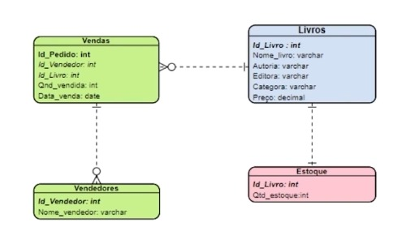

<h1 align="center">Welcome to my Repositories 🤝</h1>
<p>
  
  
  <br>
</p>

> 🌱👨‍💻 - I learned SQL for relational model, installed MySQL, created schemas/tables, added constraints/referential integrity, defined primary/foreign keys, insert data in different ways, used WHERE for filters, deleted/updated information, applied aggregate functions and joined tables with INNER JOIN, LEFT JOIN and RIGHT JOIN - all with MySQL. I created this project using the Alura course.


<br>

> Objective :


## Download

```sh
https://github.com/eucesar/Relational-Database-Modeling-Understanding-SQL.git
```

## Cesar

👤 **Cesar Iglesias**

* Github: [@eucesar](https://github.com/eucesar)
* LinkedIn: [@Cesar Iglesias](https://www.linkedin.com/in/cesar-iglesias-tecnologia/)

***
